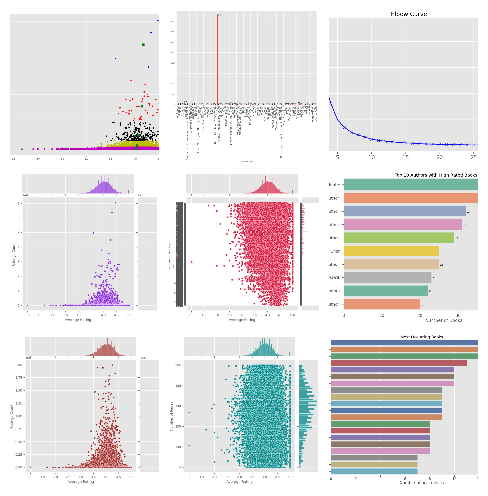
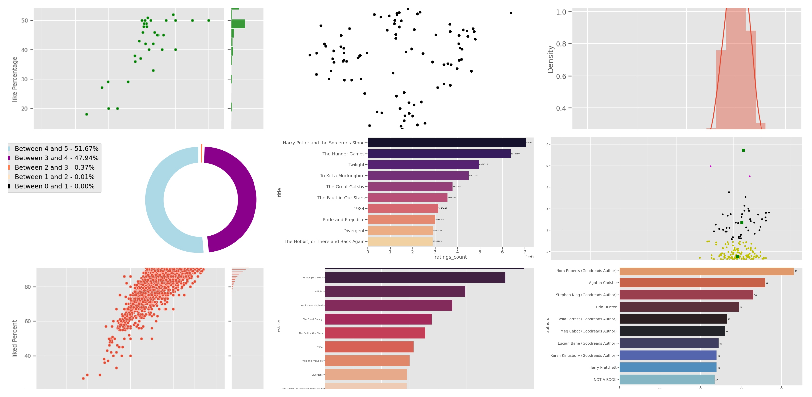

# **Data Visualization Project**

## **Book-Recommendation project**
This project analyzes a book dataset using Python libraries like **Pandas, Matplotlib, and Seaborn**. It includes **data cleaning, exploratory data analysis (EDA), visualizations, and clustering** to uncover trends in book ratings, authors, and languages. Insights can inform recommendation systems or predictive models.

## **Dataset Used**
- [**BOOK DATA SET**](https://github.com/dhananjay7nov/Interactive-Book-Insight-Dashboard-with-Customer-Segmentation-using-Python/blob/main/file_updated.csv)

## **Key Questions**
- What are the most popular books based on ratings?
- How does the distribution of book ratings vary?
- Which authors have the highest-rated books?
- How do different languages influence book ratings?
- Can clustering techniques help in categorizing books?

## **Process**
✔ **Verify** data for missing values and inconsistencies, and clean the data accordingly.
✔ **Ensure** data consistency in terms of format, types, and values.
✔ **Utilize** visualization libraries like **Matplotlib, Seaborn, and Plotly** to represent the data effectively.
✔ **Create** various types of plots and charts to answer key analytical questions.
✔ **Combine** visual elements into a coherent **dashboard** for better interactivity and dynamic insights.

## **Dashboard Interaction**
This project integrates an **interactive dashboard** to allow users to explore different book trends visually.

## **Example Visualizations**
The project includes various visualizations such as:
- 📈 **Line Charts** for tracking trends over time.
- 📊 **Bar Charts** to compare different categories.
- 🔵 **Scatter Plots** for correlation analysis.
- 🔥 **Heatmaps** to analyze patterns in large datasets.
- 📉 **Histograms** for distribution analysis.

## **Project Insights**
- 📌 **Data visualization** helps identify trends and patterns that may not be visible in raw data.
- 📌 **Insights** from the visualizations can assist in making data-driven decisions.
- 📌 **Interactive dashboards** provide dynamic exploration of the dataset.

## **Conclusion**
**Data visualization** plays a crucial role in extracting insights from complex datasets. By utilizing various visualization techniques, **businesses and researchers can better understand trends, make informed decisions, and improve overall efficiency.**

## **Author**
📝 **DHANANJAY**

